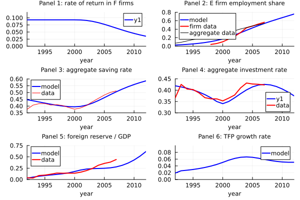
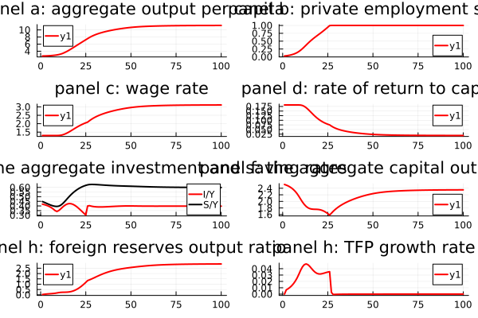
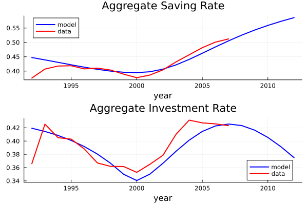
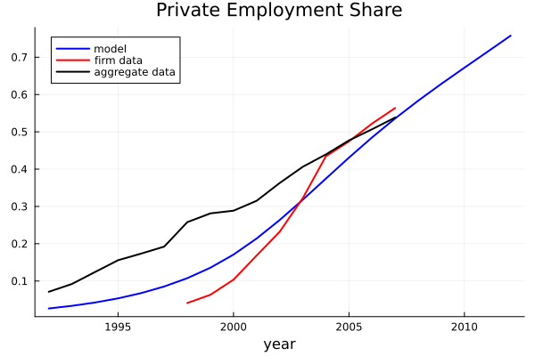
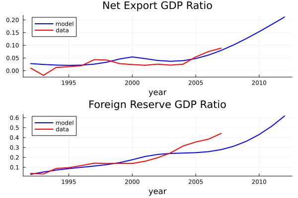
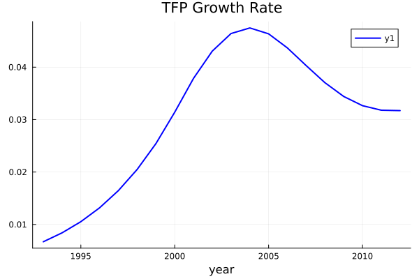
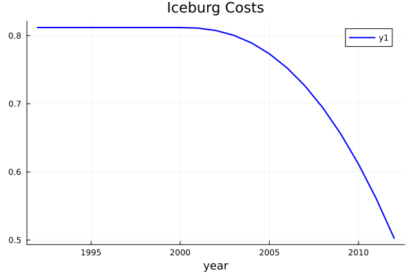
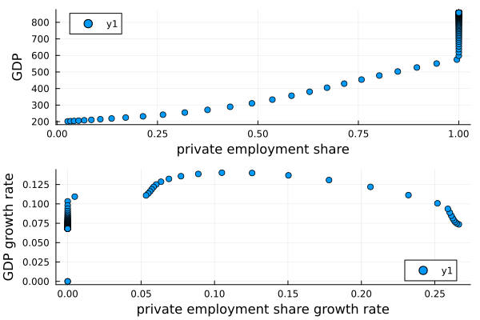
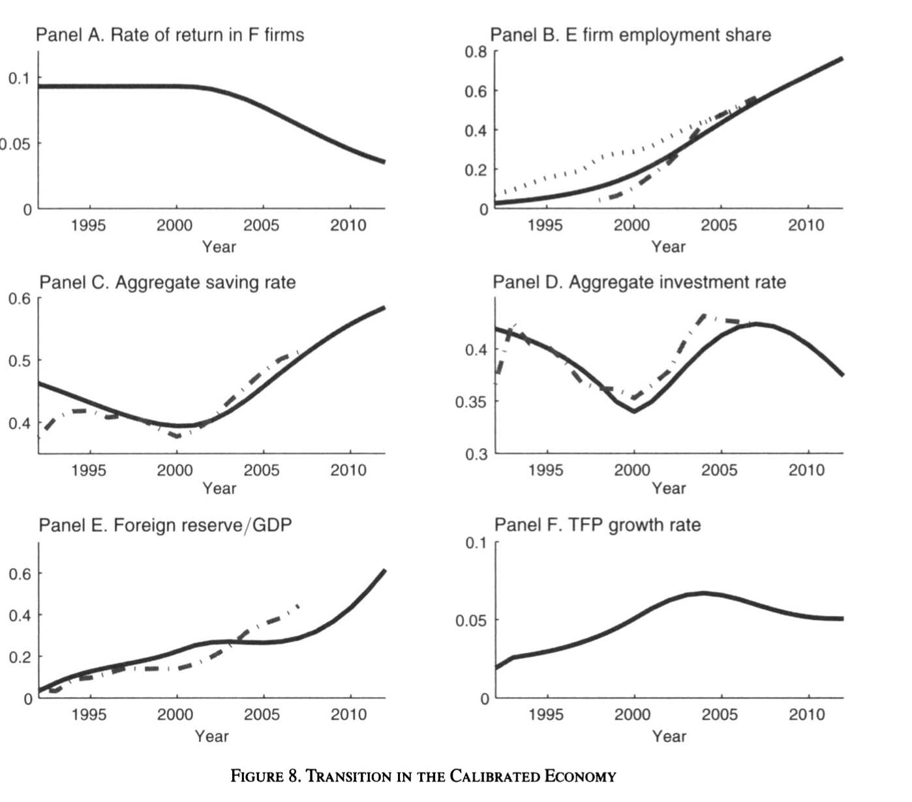

## GLC.jl: Replicate results from Song et al. (2011)
This package, most importantly, reproduces the six-panel 'Figure 8. Transition in the Calibrated Economy' (ie six_panel.png) from Song et al. (2011). The package additionally outputs the graphs that constitute Fig. 8 as separate images. The package also produces graphs describing the evolution of the iceburg cost, the aggregate rate of return to capital, the labor share, the private employment share, the growth rate of the private employment share, as well as some additional dynamics generated by the baseline model which aren't presented in the paper. 

## How to Install and Use the Package 
- Step 1: Open the Julia REPL
- Step 2: Enter the Julia package manager by typing ']'
- Step 3: Enter the following command into the Julia package manager: 
    'add https://github.com/peteratkatchenko/GLC_replication.jl'
- Step 4: Exit the Julia package manager and return to the Julia REPL by typing 'Backspace'
- Step 5: Enter the following command into the Julia REPL:
    'using GLC_replication'
- Step 6: Execute the following command:
    'glc_replicate()'
Following execution of the 'glc_replicate()' function in the Julia REPL, the file path that leads to the directory containing the resulting images will be printed. Open the indicated directory on your machine and enjoy the beautiful graphs! 

## Breakdown of the Constituent Scripts

### `GLC_replication.jl`
- **Purpose**: Initializes the basic parameters of the economic model as global variables and executes the entire replication process. The script defines the exogenously-determined parameters, calculates the calibration targets and the parameters determining TFP growth, the operation of the banking sector, the evoluation of the demographic structure, and the change in the iceburg cost. All remaining files are executed from this module.

### `pre_transition.jl`
- **Purpose**: Applies two functions in calculating the wealth, savings and consumption of workers and entrepreneurs in the pre-transition state of the baseline model. Generates variables for workers and entrepreneurs which will be used to calculate the optimal decision of the consumers during the transition period.
- **Functions Included**：
  - `fun_saving_pre_transition`
  - `fun_saving_pre_transition_E`

### `transition.jl`
- **Purpose**: Utilizes the results from `pre_transition.jl` and two functions to calculate the savings and consumption of young and old entrepreneurs. It calculates the aggregate output, capital, employment, loans and return on capital in the E sector. It returns the managerial compensation, worker compensation, and return on capital in the E sector. 
- **Functions Included**：
  - `fun_saving_E_existing`
  - `fun_saving_E_newly_born`
  - `fun_saving_F_existing`
  - `fun_saving_F_newly_born`

### `result.jl`
- **Purpose**: Calculates the aggregate variables which are then graphed in Figures 1-8.
- **Relationship**:
  - Utilizes data generated by `pre_transition.jl` and `transition.jl`.

### `six_panel.jl`
- **Purpose**: Calculates the aggregate variables which are then graphed in the six-panel replication of 'Figure 8. Transition in the Calibrated Economy'

## Figures Produced by the Replication
**Six-Panel from Replication**：

**Six-Panel from Publication**: 

**Figures 1-8**:

# Comparison

As can be seen, the replicated results exactly match the results presented in the publication. This figure depicts the evolution of key variables during the Chinese economic transition. The solid and dashed lines in the figure represent the simulation results of the model and the actual data, respectively. Panel 1 identifies a gradual decrease in the rate of return of F firms due to financial development - the publication identifies this as an implication of the calibrated model that cannot be reconciled with the empirical evidence that suggests the presence of increasing rates of return during this period. Panel 2 shows the gradual increase in the E firm employment share as labour reallocated away from F firms and towards E firms during the transition.Panel 3 shows the increase in the aggregate savings rate that accomanies the increase in entrepreneurial profits over the course of the transition. Panel 4 shows the gradual increase and then decrease in the aggregate savings rate, as sectoral reallocation towards E firms stimulates investment on the part of the entrepreneurs, which leads to capital deepening and the gradual extinguishing of returns to investment. Panel 5 shows the gradual increase in foreign reserves, as banks reorient their portfolios towards foreign bonds in light of the exit of F firms during the transition. Panel 6 captures the increase in aggregate productivity that accompanies the reallocation of factors of production towards more productive E firms during the transition.

This figure shows the evolution of key economic variables during and after the Chinese economic transition. Panels a, b, and c demonstrate the increase in aggregate output, employment and wage rate which accompany the growth of the Chinese economy during the period of structural change. Panel d demonstrates the gradual decrease in the rate of return to capital as sectoral reallocation stimulates capital deepening in E firms over time. Panel e demonstrates the initial drop and then increase in investment that accompanies the gradual shift towards E firm dominance, as well as the gradual increase in savings as entrepreneurial profits grow over the course of the transition. Panel f demonstrates the initial fall in the capital-output ratio as the economy shifts towards labor-intensive E firms, followed by an increase in the capital-output ratio as capital deepening takes hold in the same E firms. Panel g demonstrates the gradual increase in foreign reserves that occurs as banks shift their portfolios towards foreign bonds as a response to the gradual exit of favoured F firms during the transition. Panel h demonstrates how TFP growth peaks during the height of sectoral reallocation and then drops to zero as the transition is completed and the economy settles into an E firm-dominated steady-state.

## Want to Execute the Code Manually?
- Step 1: Download the package files to a common directory 
- Step 2: Open the file called 'GLC_replication.jl'
- Step 3: Remove the function wrapper for 'glc_replicate'
- Step 4: Execute 'GLC_replication.jl' - this module will automatically call all other files in the package and generate the appropriate images